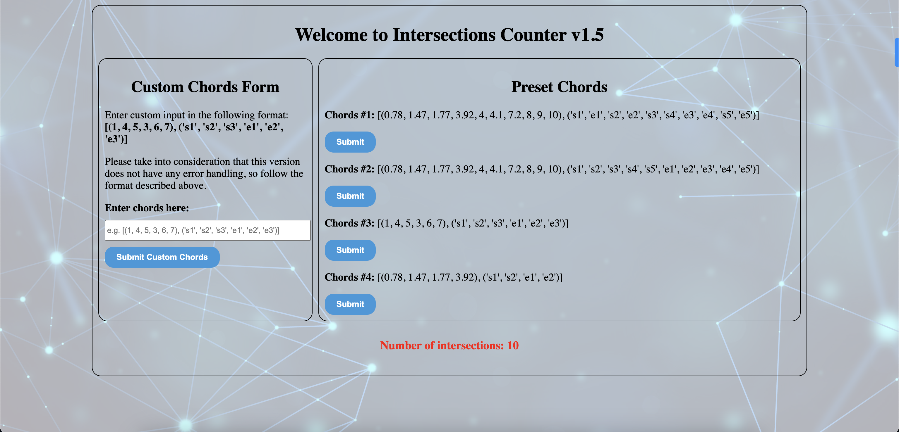

# Intersections Counter App

Welcome to the Intersections Counter v1.5 app! This simple web application allows you to count intersections in a set of chords. You can use preset chord sets or input your custom chords in the format [(1, 4, 5, 3, 6, 7), ('s1', 's2', 's3', 'e1', 'e2', 'e3')]. Please note that this version doesn't support error handling in custom field input. 



## Table of Contents
- [Big-O Runtime](#big-o-runtime)
- [Installation and Running](#installation-and-running)
    - [Using Flask](#using-flask)
    - [Using Dockerfile](#using-dockerfile)
- [new_main.py](#new_mainpy-file)

## Big-O Runtime
The algorithm has a linear time complexity O(n), where n is the length of the 'chords' list. It iterates through the list once using a two-pointer strategy. The overall efficiency is linear, making it suitable for moderate-sized inputs.

```python
def count_intersections(chords):
    intersections = 0
    length = len(chords)
        
    p1 = 0
    p2 = 1
    while p1 < length - 1:
        start1 = chords[p1][0]
        end1 = chords[p1][1]
        start2 = chords[p2][0]
        end2 = chords[p2][1]
        
        if start2 > start1 and start2 < end1 or end2 > start1 and end2 < end1:
            intersections += 1
        
        if p2 < length - 1:
            p2 += 1
        else:
            p1 += 1
            p2 = p1+1
       
    return f"Number of intersections: {intersections}"
    
def get_chords(input):
    chords = input[0]
    values = input[1]
    length = int(len(input[0]) / 2)
    sorted_chords = []
    
    my_dict = {str(i): [] for i in range(1, length  + 1)}
    
    for i in range(0, len(values)):
        num = values[i][1]
        char = values[i][0]
        if char == 's':
            my_dict[num].insert(0, chords[i])
        else:
            my_dict[num].append(chords[i])
            
    for key, value in my_dict.items():
        sorted_chords.append(value)
    
    return count_intersections(sorted_chords)
```

## Installation and Running

### Using Flask

1. Install the required dependencies:
   ```bash
   pip install -r requirements.txt
2. Run the Flask application locally:
   ```bash
   python app.py
### Using Dockerfile
1. For convinience I include dockerfile, Build the Docker image:
    ```bash
    docker build -t intersections-counter .
2. Run the Docker container:
    ```bash
    docker run -p 5001:5001 intersections-counter
3. Access the application in your browser at http://localhost:5001

## new_main.py file

If you prefer to use the original solution without going through the installation process, you can run the following command:

```bash
python3 new_main.py
```

```python
def count_intersections(chords):
    intersections = 0
    length = len(chords)
        
    p1 = 0
    p2 = 1
    while p1 < length - 1:
        start1 = chords[p1][0]
        end1 = chords[p1][1]
        start2 = chords[p2][0]
        end2 = chords[p2][1]
        
        if start2 > start1 and start2 < end1 or end2 > start1 and end2 < end1:
            intersections += 1
        
        if p2 < length - 1:
            p2 += 1
        else:
            p1 += 1
            p2 = p1+1
    
    return f"Number of intersections: {intersections}"
    
def get_chords(input):
    chords = input[0]
    values = input[1]
    length = int(len(input[0]) / 2)
    result = []
    
    my_dict = {str(i): [] for i in range(1, length  + 1)}
    
    for i in range(0, len(values)):
        num = values[i][1]
        char = values[i][0]
        if char == 's':
            my_dict[num].insert(0, chords[i])
        else:
            my_dict[num].append(chords[i])
            
    for key, value in my_dict.items():
        result.append(value)
    
    # print(result)
    
    return result
    
# chords = [(0.78, 1.47, 1.77, 3.92, 4, 4.1, 7.2, 8, 9, 10), ('s1', 'e1', 's2', 'e2', 's3', 's4', 'e3', 'e4', 's5', 'e5')]
# chords = [(1, 3.2, 6, 3, 5, 9), ('s1', 's2', 's3', 'e1', 'e2', 'e3')]
# chords = [(1, 4, 5, 3, 6, 7), ('s1', 's2', 's3', 'e1', 'e2', 'e3')]
# chords = [(0.78, 1.47, 1.77, 3.92), ('s1', 's2', 'e1', 'e2')]
chords = [(0.9, 1.3, 1.70, 2.92), ('s1', 'e1', 's2', 'e2')]
try:
    # Calculate the result
    sort_chords = get_chords(chords)
    result = count_intersections(sort_chords)
    print(result)

except Exception as e:
    print(f"Error: {e}")
    result = None
```