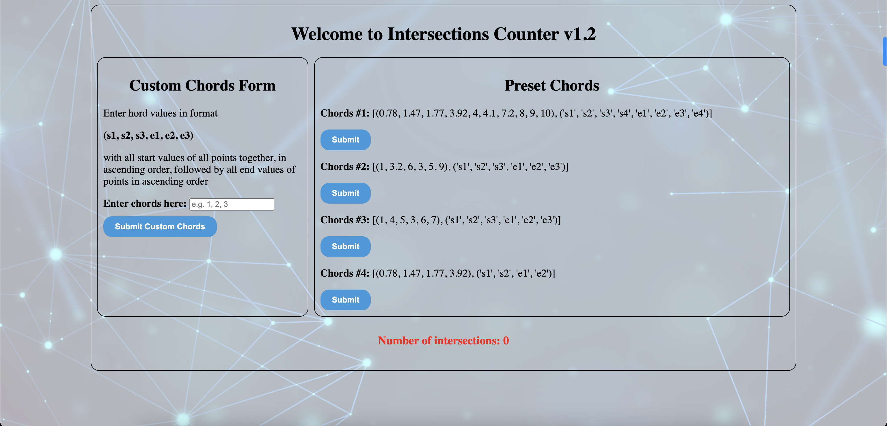

# Intersections Counter App

Welcome to the Intersections Counter v1.3 app! This simple web application allows you to count intersections in a set of chords. You can use preset chord sets or input your custom chords in the format (1, 2, 3, 4).



## Table of Contents
- [Big-O Runtime](#big-o-runtime)
- [Installation and Running](#installation-and-running)
    - [Using Flask](#using-flask)
    - [Using Dockerfile](#using-dockerfile)
- [old_main.py](#old_mainpy-file)

## Big-O Runtime
The algorithm has a linear time complexity O(n), where n is the length of the 'chords' list. It iterates through the list once using a two-pointer strategy. The overall efficiency is linear, making it suitable for moderate-sized inputs.

```python
def count_intersections(chords):
    intersections = 0
    length = int(len(chords[0]) / 2)
    
    chords = chords[0]
        
    p1 = 0
    p2 = 1
    while p1 < length - 1:
        start1 = chords[p1]
        end1 = chords[length + p1]
        start2 = chords[p2]
        end2 = chords[length + p2]
        
        if start2 > start1 and start2 < end1 or end2 > start1 and end2 < end1:
            intersections += 1
        
        if p2 < length - 1:
            p2 += 1
        else:
            p1 += 1
            p2 = p1+1
    
    return intersections
```

## Installation and Running

### Using Flask

1. Install the required dependencies:
   ```bash
   pip install -r requirements.txt
2. Run the Flask application locally:
   ```bash
   python app.py
### Using Dockerfile
1. For convinience I include dockerfile, Build the Docker image:
    ```bash
    docker build -t intersections-counter .
2. Run the Docker container:
    ```bash
    docker run -p 5001:5001 intersections-counter
3. Access the application in your browser at http://localhost:5001

## old_main.py file

If you prefer to use the original solution without going through the installation process, you can run the following command:

```bash
python3 old_main.py